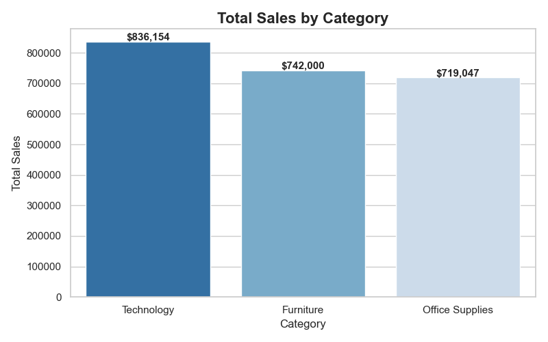
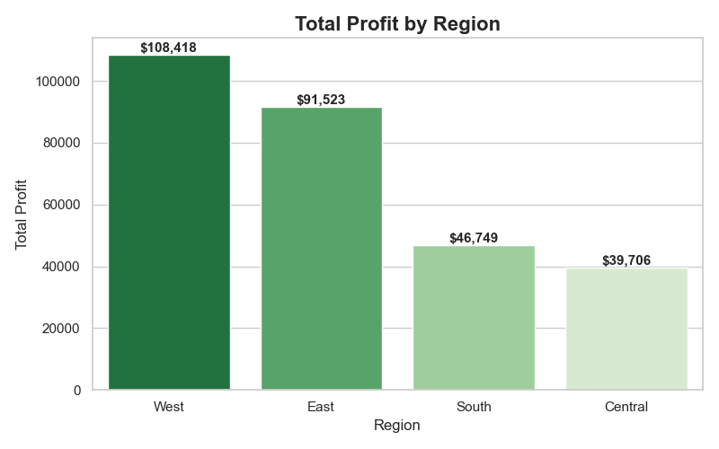
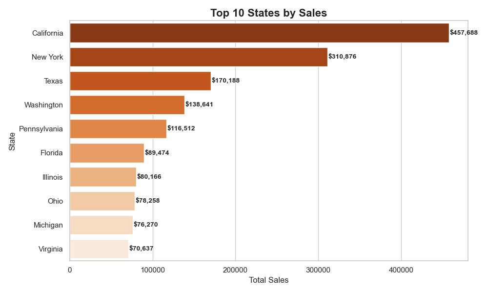
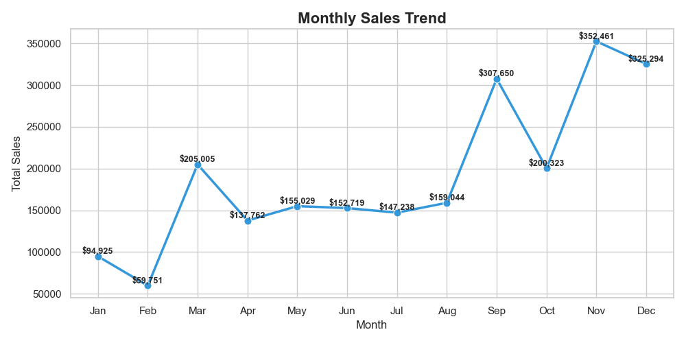
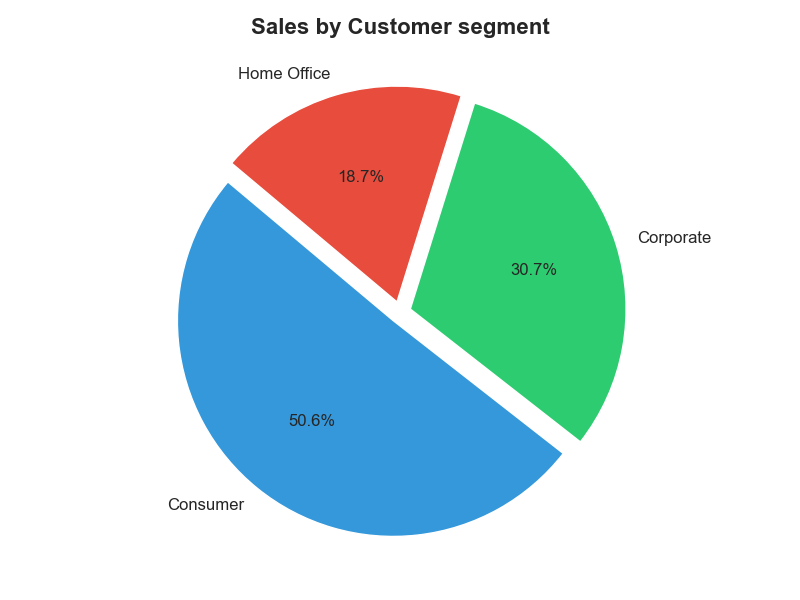

# Superstore Sales Analysis 📊

## Project Overview
Exploratory Data Analysis (EDA) on Superstore Sales dataset
with 9,994 rows and 21 columns using Python.

## Tools Used
- Python (Pandas, Matplotlib, Seaborn)
- Jupyter Notebook

## Key Insights
- Technology is top selling category ($836,154)
- West region is most profitable ($108,418)
- California is #1 state with $457,688 in sales
- November is peak sales month ($352,461)
- Consumer segment = 50.6% of total sales

## Charts

